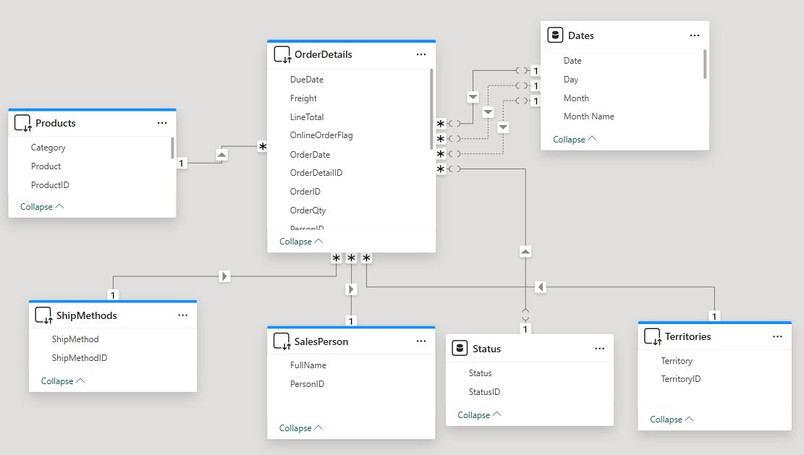

# 📊 Power BI Sales Order Dashboard – AdventureWorks

This project is an interactive Power BI dashboard built using the **AdventureWorks** dataset. It provides insights into sales orders,
including metrics like quantities, revenue, tax, and freight, while enabling users to explore the data through rich visual interactivity.

---

## 🔧 Features

- ✅ Data modeling using a **Star Schema**
- ✅ Implemented **Role-playing dimensions** to handle multiple date fields (Order Date, Ship Date, Due Date)
- ✅ Custom **DAX measures** for KPIs:
  - Total Orders
  - Total Quantity
  - SubTotal
  - Tax Amount
  - Total Due
- ✅ Interactivity:
  - Drill Down
  - Drill Through
  - Tooltips
- ✅ Visual storytelling through intuitive dashboards

---

## 🗺️ Data Model Overview

The data model follows a **Star Schema** approach, with a central fact table (`OrderDetails`) connected to several dimension tables.

Key features of the data model:
- One central **Fact table** (`OrderDetails`)
- Dimension tables: `Products`, `ShipMethods`, `SalesPerson`, `Territories`, `Status`, `Dates`
- Used the `Dates` table multiple times to support **role-playing dimensions** for:
  - `OrderDate`
  - `ShipDate`
  - `DueDate`

---

## 📈 Insights Uncovered

- 🚚 **XRQ - TRUCK** is the primary shipping method
- 🌍 **Australia and Southwest** territories lead in order volume and revenue
- 📦 **Bikes** are the top-selling category by quantity
- 💻 Over 87% of orders are placed **online**
- ⏳ Clear upward trend in orders from **2005 to 2008**

---

## 📂 Dataset

The data is sourced from Microsoft’s **AdventureWorksDW** sample database and imported into Power BI. 
The data model was cleaned and optimized using Power Query and DAX.

---

## 🛠️ Tools & Technologies

- **Power BI Desktop**
- **DAX**
- **Power Query (M)**
- **AdventureWorksDW Database**

---

## 🚀 How to Use

1. Download or clone the repository
2. Open the `.pbix` file in Power BI Desktop
3. Refresh the data or explore the visuals and measures
4. Use drill-through, tooltips, and filters to navigate between order dates and KPIs

---

## 🤝 Let's Connect

If you have feedback, ideas, or just want to talk BI, feel free to reach out on [LinkedIn](www.linkedin.com/in/sohail-ali-8b626128a).
